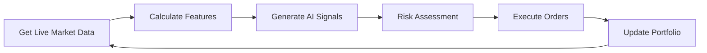

# 🤖 **AI TRADING PROCESS - COMPLETE BREAKDOWN**

## 🎯 **What Happens When You Click "Start AI Trading"**

### **Phase 1: 🔍 Validation & Setup (First 5 seconds)**

```mermaid
graph TD
    A[User Clicks "Start AI Trading"] --> B[Check Authentication]
    B --> C[Verify API Keys Exist]
    C --> D[Test Exchange Connections]
    D --> E[Initialize AI Models]
    E --> F[Setup Risk Management]
    F --> G[Start Trading Loop]
```

**1. 🔐 Authentication Check**
   - Verify user is logged in with valid session
   - Get user ID from session token
   - Check user permissions for live trading

**2. 🔑 API Keys Validation**
   - Fetch encrypted API keys from database
   - Decrypt API keys using user's encryption key
   - Verify API keys exist for at least one exchange
   - **If no API keys → STOP with error message**

**3. 🌐 Exchange Connection Testing**
   - Test connection to each configured exchange
   - Verify API keys are valid and have required permissions
   - Check if testnet or live environment
   - **If all connections fail → STOP with error message**

**4. 🤖 AI Model Loading**
   - Load trained ML models (LightGBM, RandomForest, LSTM)
   - Verify models are trained and ready
   - Create backup model if none available
   - Initialize feature engineering pipeline

**5. 🛡️ Risk Management Setup**
   - Load user's risk settings (stop loss, position size limits)
   - Set default risk parameters if none configured
   - Initialize portfolio tracking
   - Set maximum daily loss limits

---

### **Phase 2: 🔄 Continuous Trading Loop (Every 30 seconds)**



**1. 📊 Live Market Data Collection**
   ```python
   # What happens every 30 seconds:
   - Fetch live prices for 142+ instruments
   - Get volume, 24h change, market trends
   - Collect data from: NSE, NYSE, NASDAQ, Binance, etc.
   - Update real-time price database
   ```

**2. 🧮 Feature Engineering**
   ```python
   # AI processes this data:
   - Technical indicators (RSI, EMA, MACD, Bollinger Bands)
   - Price momentum and volatility
   - Volume analysis and market sentiment
   - Time-based features (hour, day, market session)
   - Cross-asset correlations
   ```

**3. 🤖 AI Signal Generation**
   ```python
   # Multiple AI models analyze:
   - Pattern recognition (support/resistance, breakouts)
   - Trend prediction (short-term price direction)
   - Risk-reward calculation
   - Confidence scoring (how sure the AI is)
   ```

**4. 🎯 Signal Processing**
   ```python
   # For each instrument, AI generates:
   {
     "symbol": "AAPL",
     "signal": "BUY",           # BUY, SELL, or HOLD
     "strength": 0.85,          # 0-1 (how strong the signal)
     "confidence": 0.92,        # 0-1 (how confident the AI is)
     "target_price": 152.30,    # Expected price movement
     "stop_loss": 148.50,       # Risk management
     "take_profit": 156.80      # Profit target
   }
   ```

**5. 🛡️ Risk Assessment**
   ```python
   # Before placing any order:
   - Check portfolio allocation (max 10% per position)
   - Verify daily loss limits not exceeded
   - Ensure sufficient buying power
   - Validate signal strength > 70%
   - Confirm exchange is operational
   ```

**6. 💰 Order Execution**
   ```python
   # If all checks pass:
   - Calculate position size based on risk
   - Place market or limit order
   - Set stop-loss and take-profit orders
   - Log order details
   - Update portfolio tracking
   ```

---

### **Phase 3: 📈 Portfolio Management (Continuous)**

**Real-time Monitoring:**
- Track all open positions
- Monitor profit/loss in real-time
- Execute stop-loss orders when triggered
- Take profits at target levels
- Rebalance portfolio periodically

**Risk Controls:**
- Maximum 10% of portfolio per position
- Maximum 5% daily loss limit
- Automatic position sizing
- Emergency stop if major losses

---

## 🚨 **CRITICAL GAPS IN CURRENT SYSTEM**

### **❌ What's Missing for Real Trading:**

1. **🔗 Real Exchange Integration**
   ```
   Current: API keys stored but not used for actual trading
   Needed: Live connection to Zerodha/Upstox/Binance APIs
   ```

2. **💼 Portfolio Balance Fetching**
   ```
   Current: Uses dummy $10,000 portfolio
   Needed: Fetch real account balance from exchanges
   ```

3. **📊 Comprehensive Instrument Coverage**
   ```
   Current: ~142 instruments
   Needed: 5,000+ stocks from NSE, BSE, NYSE, NASDAQ
   ```

4. **🔄 Order Status Tracking**
   ```
   Current: Simulated orders
   Needed: Real order placement and status monitoring
   ```

---

## 🎯 **WHAT WE NEED TO COMPLETE**

### **1. Real Exchange Integration**
```python
# Instead of simulation, actual API calls:
binance_api.place_order(symbol="BTCUSDT", side="buy", quantity=0.1)
zerodha_api.place_order(symbol="RELIANCE", side="buy", quantity=10)
```

### **2. Portfolio Sync**
```python
# Fetch real portfolio data:
portfolio = {
    "total_value": fetch_from_zerodha(),
    "positions": get_current_positions(),
    "cash_balance": get_available_cash(),
    "buying_power": calculate_buying_power()
}
```

### **3. Comprehensive Instrument Database**
```python
# Expand from 142 to 5,000+ instruments:
instruments = {
    "NSE": load_all_nse_stocks(),      # ~1,800 stocks
    "BSE": load_all_bse_stocks(),      # ~3,000 stocks  
    "NYSE": load_all_nyse_stocks(),    # ~2,800 stocks
    "NASDAQ": load_all_nasdaq_stocks(),# ~3,300 stocks
    "Crypto": load_all_crypto_pairs()  # ~500+ pairs
}
```

### **4. Live Order Management**
```python
# Real order lifecycle:
order = place_live_order(symbol, quantity, price)
monitor_order_status(order.id)
handle_partial_fills(order.id)
update_portfolio_on_fill(order)
```

---

## 🚀 **IMMEDIATE NEXT STEPS**

1. **🔧 Fix Current System** - Get basic AI trading working with simulation
2. **🌐 Real API Integration** - Connect to actual exchanges  
3. **📊 Expand Instruments** - Add comprehensive stock/crypto coverage
4. **💼 Portfolio Sync** - Fetch real account balances
5. **🔄 Live Orders** - Place and monitor actual trades

Would you like me to implement any of these specific components?
