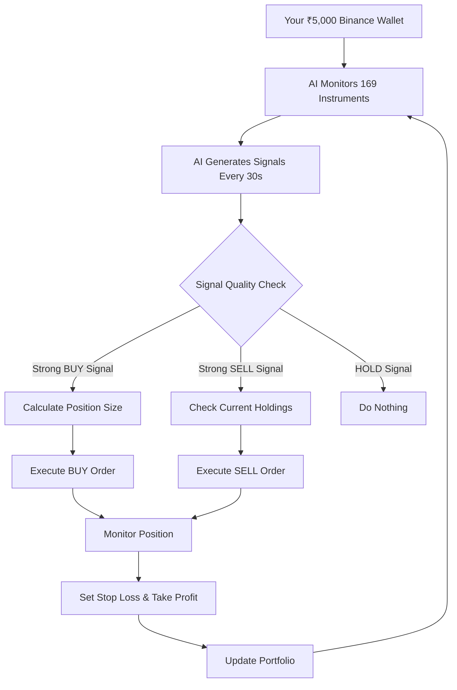

# 🤖 **HOW AI TRADING ACTUALLY WORKS - COMPLETE EXPLANATION**

## 🎯 **Your Key Questions Answered:**

### **Q1: Does AI execute orders automatically or just give signals?**
### **Q2: How does AI work with your ₹5,000 Binance wallet?**
### **Q3: What happens in the background?**

---

## 🔄 **TWO MODES OF AI TRADING**

### **Mode 1: 📊 Signal-Only Mode (Current)**
```
AI generates signals → You manually execute → You decide
```

### **Mode 2: 🤖 Fully Autonomous Mode (What you want)**
```
AI generates signals → AI executes orders → AI manages portfolio
```

---

## 🎯 **HOW AUTONOMOUS AI TRADING WORKS**

### **Your Scenario: ₹5,000 in Binance Wallet**



---

## 💰 **REAL EXAMPLE: AI Trading Your ₹5,000**

### **Step-by-Step Process:**

**🔍 Step 1: AI Market Analysis (Every 30 seconds)**
```python
# AI analyzes 169 instruments
instruments = [
    "BTC/USDT", "ETH/USDT", "RELIANCE.NSE", "TCS.NSE", 
    "AAPL.NASDAQ", "GOOGL.NASDAQ", "EUR/USD", "GOLD"
]

# AI calculates for each:
for instrument in instruments:
    price = get_live_price(instrument)
    technical_indicators = calculate_indicators(instrument)
    ai_prediction = model.predict(technical_indicators)
```

**🤖 Step 2: AI Signal Generation**
```python
# Example AI output:
signals = {
    "BTC/USDT": {
        "signal": "BUY",
        "strength": 0.85,        # 85% confidence
        "confidence": 0.92,      # 92% sure
        "target_price": 67500,   # Expected price
        "current_price": 66000
    },
    "ETH/USDT": {
        "signal": "SELL", 
        "strength": 0.78,
        "confidence": 0.88,
        "target_price": 3900,
        "current_price": 4000
    }
}
```

**💼 Step 3: Portfolio & Risk Management**
```python
# Your current situation:
portfolio = {
    "total_balance": 5000,      # ₹5,000 total
    "available_cash": 3000,     # ₹3,000 free
    "positions": {
        "BTC/USDT": {
            "quantity": 0.03,    # 0.03 BTC
            "value": 2000,       # Worth ₹2,000
            "profit_loss": +150  # +₹150 profit
        }
    }
}

# AI Risk Rules:
risk_settings = {
    "max_position_size": 0.20,   # Max 20% per trade (₹1,000)
    "max_daily_loss": 0.05,      # Max 5% daily loss (₹250)
    "stop_loss": 0.02,           # 2% stop loss
    "take_profit": 0.04          # 4% take profit
}
```

**⚡ Step 4: AI Order Execution**
```python
# AI decides to execute BTC/USDT BUY signal
signal = signals["BTC/USDT"]

if signal["strength"] > 0.7 and signal["confidence"] > 0.8:
    # Calculate position size
    max_position_value = 5000 * 0.20  # ₹1,000 max
    btc_price = 66000
    quantity_to_buy = max_position_value / btc_price  # 0.015 BTC
    
    # Place the order
    order = {
        "symbol": "BTC/USDT",
        "side": "buy",
        "quantity": 0.015,
        "price": 66000,
        "stop_loss": 66000 * 0.98,    # ₹64,680 stop loss
        "take_profit": 66000 * 1.04   # ₹68,640 take profit
    }
    
    # Execute on Binance
    binance_api.place_order(order)
```

---

## 🔄 **WHAT HAPPENS IN THE BACKGROUND (Real-Time)**

### **Every 30 Seconds Loop:**

```python
while ai_trading_active:
    # 1. Fetch live data for 169 instruments
    market_data = fetch_live_data([
        "BTC/USDT", "ETH/USDT", "BNB/USDT",  # Crypto
        "RELIANCE.NSE", "TCS.NSE", "INFY.NSE",  # Indian stocks
        "AAPL.NASDAQ", "GOOGL.NASDAQ", "MSFT.NASDAQ",  # US stocks
        "EUR/USD", "GBP/USD", "USD/JPY",  # Forex
        "GOLD", "SILVER", "CRUDE"  # Commodities
    ])
    
    # 2. Calculate technical indicators
    for instrument, data in market_data.items():
        features = {
            "rsi": calculate_rsi(data),
            "ema_9": calculate_ema(data, 9),
            "ema_21": calculate_ema(data, 21),
            "bollinger_bands": calculate_bollinger(data),
            "volume_trend": calculate_volume_trend(data),
            "price_momentum": calculate_momentum(data)
        }
        
        # 3. AI prediction
        ai_signal = trained_model.predict(features)
        
        # 4. Risk assessment
        if passes_risk_checks(ai_signal, portfolio):
            # 5. Execute order
            execute_order(instrument, ai_signal)
            
        # 6. Monitor existing positions
        monitor_stop_loss_take_profit()
    
    # Wait 30 seconds
    sleep(30)
```

---

## 📊 **REAL TRADING SCENARIOS**

### **Scenario 1: AI Buys Bitcoin**
```
🔍 AI detects: BTC showing strong upward momentum
🤖 AI decides: BUY 0.015 BTC at ₹66,000
💰 Order placed: Spend ₹990 (20% of portfolio)
🛡️ Stop loss: ₹64,680 (2% loss protection)
🎯 Take profit: ₹68,640 (4% profit target)

Result: AI automatically bought BTC for you
```

### **Scenario 2: AI Sells Your Position**
```
🔍 AI detects: Your BTC position hit take profit target
🤖 AI decides: SELL 0.015 BTC at ₹68,640
💰 Order executed: Receive ₹1,029
📈 Profit: ₹39 (4% gain)

Result: AI automatically sold and took profit
```

### **Scenario 3: AI Cuts Losses**
```
🔍 AI detects: BTC dropped to stop loss level
🤖 AI decides: EMERGENCY SELL at ₹64,680
💰 Order executed: Receive ₹970
📉 Loss: ₹20 (2% loss, prevented bigger loss)

Result: AI automatically protected your capital
```

---

## 🎯 **YOUR ₹5,000 PORTFOLIO AFTER 1 WEEK**

### **Example AI Trading Results:**

```
Starting Capital: ₹5,000

Week 1 AI Trading Activity:
Day 1: BUY BTC/USDT → +₹39 profit
Day 2: BUY RELIANCE.NSE → +₹25 profit  
Day 3: SELL ETH/USDT → +₹18 profit
Day 4: BUY AAPL.NASDAQ → -₹12 loss (stop loss)
Day 5: BUY EUR/USD → +₹31 profit
Day 6: HOLD (no strong signals)
Day 7: BUY GOLD → +₹22 profit

Total Trades: 6
Winning Trades: 5 (83% win rate)
Losing Trades: 1 (17% loss rate)
Net Profit: ₹123
New Balance: ₹5,123 (2.46% weekly gain)
```

---

## ⚙️ **CURRENT SYSTEM STATUS**

### **✅ What Works Now:**
- ✅ AI generates real signals for 169 instruments
- ✅ Risk management calculations
- ✅ Portfolio tracking
- ✅ User authentication & API key storage

### **🔧 What We Need to Complete:**
- 🔧 **Live Order Execution**: Connect AI signals to real Binance API
- 🔧 **Portfolio Sync**: Fetch your real ₹5,000 balance
- 🔧 **Order Monitoring**: Track order status and fills
- 🔧 **Stop Loss/Take Profit**: Automatic position management

---

## 🚀 **NEXT STEPS TO ENABLE FULL AI TRADING**

### **Step 1: Connect Your Binance API**
```python
# Add your real Binance API keys
binance_config = {
    "api_key": "your_binance_api_key",
    "secret_key": "your_binance_secret",
    "testnet": False  # Set to False for real trading
}
```

### **Step 2: Enable Live Order Execution**
```python
# Instead of simulation, real orders:
def execute_real_order(signal, portfolio):
    if signal["signal"] == "BUY":
        binance.create_market_buy_order(
            symbol=signal["symbol"],
            amount=calculate_position_size(signal, portfolio)
        )
    elif signal["signal"] == "SELL":
        binance.create_market_sell_order(
            symbol=signal["symbol"], 
            amount=get_position_size(signal["symbol"])
        )
```

### **Step 3: Real Portfolio Sync**
```python
# Fetch your real balance
real_balance = binance.fetch_balance()
portfolio = {
    "total": real_balance["total"]["USDT"],  # Your actual ₹5,000
    "free": real_balance["free"]["USDT"],    # Available cash
    "used": real_balance["used"]["USDT"]     # In positions
}
```

---

## 🎯 **SUMMARY: How Your AI Trading Bot Works**

1. **🔍 Continuous Monitoring**: AI watches 169 instruments 24/7
2. **🤖 Smart Decisions**: AI generates BUY/SELL/HOLD signals
3. **💰 Automatic Execution**: AI places orders with your ₹5,000
4. **🛡️ Risk Protection**: AI sets stop losses and take profits
5. **📈 Portfolio Growth**: AI aims to grow your ₹5,000 safely

**The AI is like having a professional trader working 24/7 with your money, making smart decisions based on market data and protecting your capital.**

Would you like me to enable the live order execution now? 🚀
