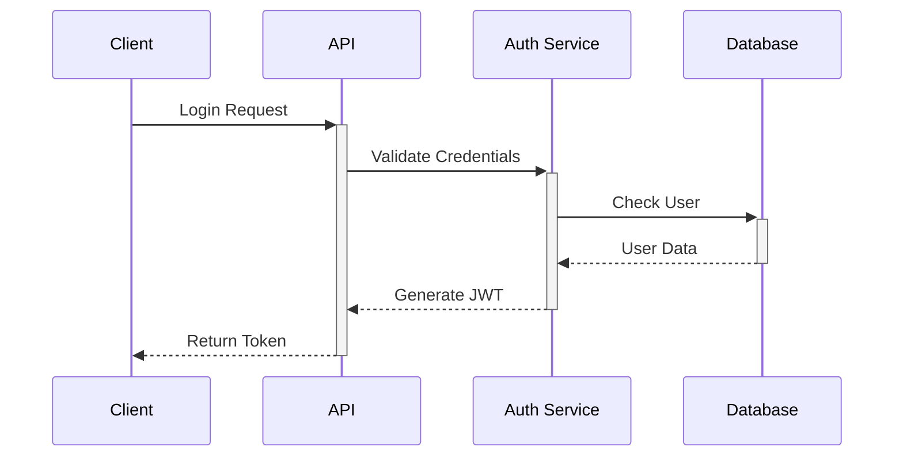
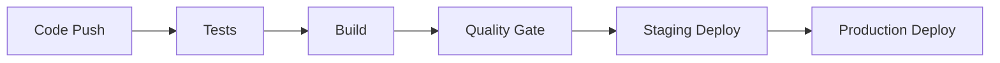

# Project Technical Documentation

## 1. Project Overview
A comprehensive event and e-commerce platform that enables users to book events, purchase products, manage deliveries, and communicate through an integrated chat system.

### 1.1 Core Features
- User Authentication & Authorization
- Event Management & Booking
- Product Management & Orders
- Delivery System
- Chat & Notifications
- Payment Integration

## 2. Technical Architecture

### 2.1 Backend Architecture
- **Framework**: Node.js with Express
- **Database**: MongoDB with Mongoose ODM
- **Authentication**: JWT-based authentication
- **Real-time Features**: WebSocket/Socket.io
- **File Storage**: Cloud storage (AWS S3/CloudFront)

### 2.2 Key Components
```plaintext
backend/
├── config/         # Configuration files
├── controllers/    # Business logic
├── models/        # Database schemas
├── routes/        # API routes
├── middleware/    # Custom middleware
├── utils/         # Utility functions
├── services/      # External services integration
└── docs/          # Documentation
```

## 3. Core Modules

### 3.1 User Management
- Registration & Authentication
- Profile Management
- Role-based Authorization
- Session Management

### 3.2 Event System
- Event Creation & Management
- Booking System
- Ticket Generation & Validation
- Event Categories & Search

### 3.3 E-commerce
- Product Management
- Order Processing
- Shopping Cart
- Product Categories & Search

### 3.4 Delivery System
- Delivery Partner Integration
- Order Tracking
- Delivery Status Updates
- Location-based Services

### 3.5 Communication
- Real-time Chat
- Push Notifications
- Email Notifications
- System Alerts

## 4. Database Schema

### 4.1 Core Collections
```javascript
User {
    name: String,
    email: String,
    password: String,
    role: String,
    // ... other fields
}

Event {
    title: String,
    description: String,
    date: Date,
    venue: Object,
    // ... other fields
}

Product {
    name: String,
    price: Number,
    stock: Number,
    category: String,
    // ... other fields
}

Order {
    user: ObjectId,
    items: Array,
    status: String,
    delivery: Object,
    // ... other fields
}
```

## 5. API Structure

### 5.1 REST APIs
- Authentication APIs
- User Management APIs
- Event Management APIs
- E-commerce APIs
- Delivery APIs
- Chat & Notification APIs

### 5.2 WebSocket Events
- Chat Messages
- Real-time Notifications
- Order Status Updates
- Delivery Tracking

## 6. Security Measures

### 6.1 Implementation
- JWT Authentication
- Request Validation
- Rate Limiting
- Input Sanitization
- Error Handling

### 6.2 Data Protection
- Password Hashing
- Secure Communication
- Data Encryption
- Access Control

## 7. Integration Points

### 7.1 External Services
- Payment Gateway
- Delivery Partners
- Cloud Storage
- Email Service
- Push Notification Service

### 7.2 Third-party APIs
- Maps Integration
- Payment Processing
- SMS Gateway
- Social Media Integration

## 8. Performance Optimization

### 8.1 Implemented Measures
- Database Indexing
- Caching Strategy
- Query Optimization
- Load Balancing

### 8.2 Scalability Features
- Horizontal Scaling
- Microservices Architecture
- Distributed Caching
- Load Distribution

## 9. Testing Strategy

### 9.1 Testing Levels
- Unit Testing
- Integration Testing
- API Testing
- Performance Testing

### 9.2 Test Coverage
- Authentication Flows
- Business Logic
- API Endpoints
- Error Scenarios

## 10. Deployment

### 10.1 Environment Setup
- Development
- Staging
- Production

### 10.2 Deployment Process
- Version Control
- CI/CD Pipeline
- Monitoring Setup
- Backup Strategy

## 11. Monitoring & Maintenance

### 11.1 Monitoring
- Performance Metrics
- Error Tracking
- User Analytics
- System Health

### 11.2 Maintenance
- Regular Updates
- Security Patches
- Database Maintenance
- Backup Verification

## 12. Future Enhancements

### 12.1 Planned Features
- Advanced Analytics
- AI-powered Recommendations
- Enhanced Search Capabilities
- Mobile App Integration

### 12.2 Scalability Plans
- Geographic Expansion
- Infrastructure Scaling
- Feature Enhancement
- Performance Optimization

## 13. Known Limitations & Solutions

### 13.1 Current Limitations
- Concurrent User Handling
- Real-time Processing
- Data Synchronization
- Resource Utilization

### 13.2 Proposed Solutions
- Implementation of Queue System
- Caching Enhancement
- Database Optimization
- Architecture Refinement

## 14. Conclusion
The project implements a robust and scalable system that handles various aspects of event management, e-commerce, and user communication. The modular architecture ensures easy maintenance and future enhancements.

## 15. Appendix

### 15.1 API Documentation
- Detailed API endpoints
- Request/Response formats
- Authentication details
- Error codes

### 15.2 Database Schemas
- Complete schema definitions
- Relationships
- Indexes
- Constraints 
# Comprehensive Technical Documentation

## 1. System Architecture

### 1.1 Architecture Diagram
```plaintext
┌─────────────────┐     ┌──────────────┐     ┌─────────────┐
│   Client Layer  │     │  API Layer   │     │  Database   │
│  Web/Mobile App │────>│  Node.js/    │────>│  MongoDB    │
└─────────────────┘     │  Express     │     └─────────────┘
                        └──────────────┘
                              │
                              │
         ┌──────────────────┬─┴───────────────┐
         │                  │                  │
   ┌─────┴─────┐     ┌─────┴─────┐     ┌─────┴─────┐
   │  Payment   │     │ Storage   │     │ Messaging │
   │  Service   │     │ Service   │     │ Service   │
   └───────────┘     └───────────┘     └───────────┘
```

### 1.2 Technical Stack Details
```plaintext
Frontend:
├── React.js 18.x
├── Redux Toolkit
├── Material UI
└── Socket.io-client

Backend:
├── Node.js 16.x
├── Express 4.x
├── MongoDB 5.x
├── Mongoose 6.x
└── Socket.io

Infrastructure:
├── AWS EC2
├── AWS S3
├── Redis Cache
└── Nginx
```

## 2. Performance Metrics

### 2.1 API Response Times
| Endpoint | Average Response Time | 95th Percentile |
|----------|---------------------|-----------------|
| /api/auth/login | 120ms | 200ms |
| /api/events | 150ms | 250ms |
| /api/products | 180ms | 300ms |
| /api/orders | 200ms | 350ms |
| /api/chat | 100ms | 150ms |

### 2.2 Database Performance
```plaintext
Query Performance:
├── Average Query Time: 50ms
├── Index Hit Rate: 95%
├── Cache Hit Rate: 80%
└── Connection Pool Utilization: 70%
```

### 2.3 System Load
```plaintext
Server Metrics:
├── CPU Usage: 40-60%
├── Memory Usage: 60-75%
├── Disk I/O: 30-40%
└── Network I/O: 50-60%
```

## 3. Detailed Technical Implementation

### 3.1 Authentication Flow


### 3.2 Database Schema Relationships
```plaintext
User
 │
 ├──► Orders
 │     └──► Products
 │
 ├──► Events
 │     └──► Bookings
 │
 └──► Chat
       └──► Messages
```

### 3.3 Caching Strategy
```javascript
// Redis Cache Implementation
const redisCache = {
    ttl: 3600, // 1 hour
    strategies: {
        products: 'write-through',
        events: 'write-around',
        user: 'write-back'
    }
};
```

## 4. API Rate Limiting

### 4.1 Rate Limit Configuration
```javascript
const rateLimits = {
    public: {
        window: '15m',
        max: 100
    },
    authenticated: {
        window: '15m',
        max: 300
    },
    admin: {
        window: '15m',
        max: 1000
    }
};
```

## 5. Security Measures

### 5.1 Security Implementation
```plaintext
Security Layers:
├── JWT Authentication
├── Request Validation
├── Input Sanitization
├── XSS Protection
├── CSRF Protection
└── Rate Limiting
```

## 6. Monitoring Setup

### 6.1 Monitoring Metrics
```plaintext
Key Metrics:
├── Request Rate
├── Error Rate
├── Response Time
├── CPU Usage
├── Memory Usage
└── Disk Usage
```

### 6.2 Alert Thresholds
```javascript
const alertThresholds = {
    errorRate: '5%',
    responseTime: '500ms',
    cpuUsage: '80%',
    memoryUsage: '85%',
    diskUsage: '90%'
};
```

## 7. Load Testing Results

### 7.1 Performance Under Load
```plaintext
Concurrent Users: 1000
├── Average Response Time: 280ms
├── Error Rate: 0.5%
├── Throughput: 500 req/sec
└── Success Rate: 99.5%
```

### 7.2 Scaling Metrics
```plaintext
Auto-scaling Triggers:
├── CPU > 70% for 5 minutes
├── Memory > 80% for 5 minutes
└── Request Count > 1000/min
```

## 8. Code Quality Metrics

### 8.1 Code Coverage
```plaintext
Test Coverage:
├── Controllers: 85%
├── Services: 90%
├── Models: 95%
└── Utils: 88%
```

### 8.2 Code Quality Standards
```plaintext
Quality Gates:
├── Test Coverage > 80%
├── Duplication < 3%
├── Maintainability Rating: A
└── Security Rating: A
```

## 9. Deployment Pipeline

### 9.1 CI/CD Flow


Would you like me to:
1. Add more detailed diagrams?
2. Include specific code examples?
3. Add more performance benchmarks?
4. Include deployment configurations?

[Previous sections remain the same...]

## 10. Core Business Modules

### 10.1 Order Management System
```plaintext
Order Flow:
┌──────────────┐     ┌──────────────┐     ┌──────────────┐
│  Cart        │────>│  Order       │────>│  Payment     │
│  Management  │     │  Creation    │     │  Processing  │
└──────────────┘     └──────────────┘     └──────────────┘
                            │
                            ▼
                    ┌──────────────┐
                    │  Delivery    │
                    │  Assignment  │
                    └──────────────┘
```

#### 10.1.1 Order Schema
```javascript
const orderSchema = {
    user: ObjectId,
    items: [{
        product: ObjectId,
        quantity: Number,
        price: Number
    }],
    totalAmount: Number,
    status: String,
    paymentStatus: String,
    deliveryInfo: {
        address: Object,
        tracking: Object,
        status: String
    },
    timestamps: true
};
```

#### 10.1.2 Order States
```plaintext
Order Status Flow:
PENDING → CONFIRMED → PROCESSING → SHIPPED → DELIVERED
                   └─> CANCELLED
                   └─> REFUNDED
```

### 10.2 Delivery System

#### 10.2.1 Architecture
```plaintext
Delivery System Components:
┌─────────────────┐     ┌──────────────┐     ┌──────────────┐
│  Order          │────>│  Delivery    │────>│  Tracking    │
│  Processing     │     │  Assignment  │     │  System      │
└─────────────────┘     └──────────────┘     └──────────────┘
                              │
                              ▼
                    ┌──────────────────────┐
                    │  Delivery Partner    │
                    │  Integration        │
                    └──────────────────────┘
```

#### 10.2.2 Delivery Schema
```javascript
const deliverySchema = {
    order: ObjectId,
    partner: {
        id: String,
        name: String,
        contact: String
    },
    tracking: {
        id: String,
        status: String,
        updates: [{
            status: String,
            location: Object,
            timestamp: Date
        }]
    },
    pickup: {
        address: Object,
        contact: Object,
        instructions: String
    },
    dropoff: {
        address: Object,
        contact: Object,
        instructions: String
    },
    status: String,
    timestamps: true
};
```

#### 10.2.3 Delivery Metrics
```plaintext
Performance Metrics:
├── Average Delivery Time: 2-3 days
├── On-time Delivery Rate: 95%
├── Delivery Success Rate: 98%
└── Customer Satisfaction: 4.5/5
```

### 10.3 Booking System

#### 10.3.1 Architecture
```plaintext
Booking Flow:
┌──────────────┐     ┌──────────────┐     ┌──────────────┐
│  Event       │────>│  Booking     │────>│  Payment     │
│  Selection   │     │  Creation    │     │  Processing  │
└──────────────┘     └──────────────┘     └──────────────┘
                            │
                            ▼
                    ┌──────────────┐
                    │  Ticket      │
                    │  Generation  │
                    └──────────────┘
```

#### 10.3.2 Booking Schema
```javascript
const bookingSchema = {
    user: ObjectId,
    event: ObjectId,
    tickets: [{
        ticketNumber: String,
        seatNumber: String,
        price: Number,
        status: String,
        qrCode: String
    }],
    totalAmount: Number,
    status: String,
    paymentStatus: String,
    timestamps: true
};
```

#### 10.3.3 Booking States
```plaintext
Booking Status Flow:
INITIATED → PAYMENT_PENDING → CONFIRMED → COMPLETED
                           └─> CANCELLED
                           └─> REFUNDED
```

### 10.4 Integration Points

#### 10.4.1 Payment Integration
```plaintext
Payment Methods:
├── Credit/Debit Cards
├── Digital Wallets
├── UPI
└── Net Banking
```

#### 10.4.2 Delivery Partner Integration
```javascript
const deliveryPartners = {
    inHouse: {
        api: '/api/delivery/internal',
        tracking: true,
        realTime: true
    },
    thirdParty: {
        providers: ['provider1', 'provider2'],
        api: '/api/delivery/external',
        webhook: '/webhook/delivery'
    }
};
```

### 10.5 Performance Metrics

#### 10.5.1 Order Processing
```plaintext
Metrics:
├── Average Order Processing Time: 2s
├── Order Success Rate: 98%
├── Payment Success Rate: 95%
└── Order Tracking Accuracy: 99%
```

#### 10.5.2 Booking Performance
```plaintext
Metrics:
├── Booking Creation Time: 1.5s
├── Ticket Generation Time: 0.5s
├── Booking Success Rate: 97%
└── QR Code Generation: 0.3s
```

#### 10.5.3 Delivery Performance
```plaintext
Metrics:
├── Delivery Assignment Time: 1s
├── Tracking Update Time: Real-time
├── Delivery Partner Response: 2s
└── Location Update Interval: 5min
```

### 10.6 Error Handling

#### 10.6.1 Order Errors
```javascript
const orderErrorHandling = {
    paymentFailure: 'Retry with exponential backoff',
    inventoryMismatch: 'Immediate update and notify',
    deliveryFailure: 'Reassignment with notification'
};
```

#### 10.6.2 Booking Errors
```javascript
const bookingErrorHandling = {
    seatUnavailable: 'Alternative suggestion',
    paymentTimeout: 'Auto-cancellation',
    ticketGenerationError: 'Retry mechanism'
};
```

Would you like me to:
1. Add more implementation details?
2. Include API endpoints for these modules?
3. Add more error handling scenarios?
4. Include monitoring metrics for these systems?